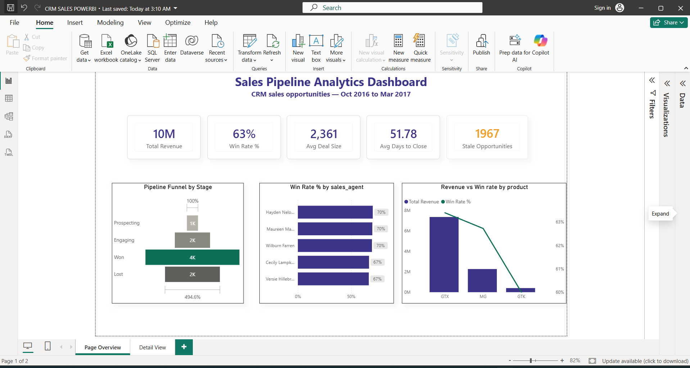
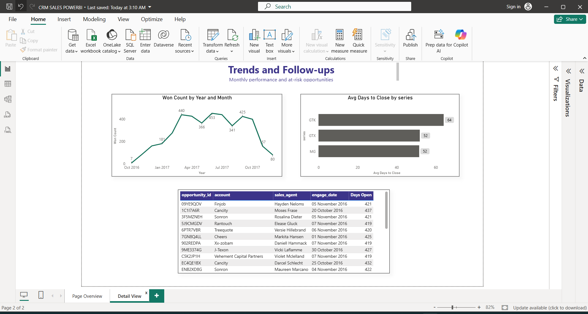

# Sales Pipeline Analytics Dashboard

A Power BI dashboard built to analyze CRM sales pipeline performance — win rates, revenue trends, sales rep performance, and at-risk opportunities. Built specifically to demonstrate the skills required for **Analytics and Modeling Associate (Sales Insights & Intelligence)** roles, including Power BI dashboarding, data modeling, sales trend analysis, and pipeline hygiene monitoring.

## Project overview

This project analyzes ~8,800 CRM sales opportunities to answer core sales operations questions: Where are deals getting stuck in the pipeline? Which products and reps are performing best? How long does it typically take to close a deal? Which opportunities need immediate follow-up?

The end result is a 2-page interactive Power BI dashboard covering an executive overview and a detailed trends/follow-up view.

## Dataset

- **Source:** CRM Sales Opportunities dataset (Maven Analytics)
- **Scale:** ~8,800 sales pipeline records
- **Structure:** 4 related tables
  - `sales_pipeline` — one row per deal (fact table)
  - `accounts` — company/client master data
  - `products` — product catalog
  - `sales_teams` — sales agent → manager → regional office mapping
- **Time period:** October 2016 – late 2017

## Data cleaning process

Cleaning was done in two stages: initial profiling and cleanup in Excel, followed by additional data modeling fixes in Power Query.

**Issues found and fixed:**
- **Product name mismatch:** `"GTXPro"` in the pipeline table didn't match `"GTX Pro"` in the products table — this silently breaks table relationships if left unfixed. Corrected via Find & Replace.
- **Typos in the accounts table:** `"technolgy"` → `"technology"`, `"Philipines"` → `"Philippines"` — caught by profiling each column's unique values.
- **Blank account values (~1,425 rows):** Early-stage deals with no company assigned yet. Replaced with `"Unassigned"` rather than left blank, to make the gap explicit.
- **Blank close_date / close_value (~2,089 rows):** Initially could be mistaken for missing data, but these are simply deals still open (Engaging/Prospecting stage) that haven't closed yet. Left blank rather than filled with 0, to avoid conflating "not yet decided" with "Lost" (which genuinely is 0).
- **Broken table headers:** The `sales_teams` file loaded with generic Column1/2/3 headers instead of real column names — fixed using Power Query's "Use First Row as Headers."

## Data modeling (Power BI)

Built a star schema in Power BI:
- `sales_pipeline` (fact table) connected to `accounts`, `products`, and `sales_teams` (dimension tables) via many-to-one relationships
- A custom `DateTable` (built with `CALENDAR()`) connected to `engage_date`, enabling proper time-intelligence and chronological sorting
- A `Stage Sort Order` helper column to ensure the pipeline funnel displays stages in logical business order (Prospecting → Engaging → Won → Lost) rather than alphabetically

**Key DAX measures built:**
- `Total Revenue` — sum of close_value, filtered to Won deals only
- `Win Rate %` — Won deals ÷ (Won + Lost) deals, using `DIVIDE()` for safe division
- `Avg Deal Size`, `Avg Days to Close` — averaged over Won deals only
- `Stale Opportunities Count` — deals still open (Engaging/Prospecting) that have been sitting for 90+ days, using the dataset's latest date as a reference point since the data is historical
- `Days Open` — a calculated column tracking how long each open deal has been active, used to power the stale opportunities follow-up table

## Dashboard & key insights

**Page 1 — Overview**
- KPI cards: Total Revenue, Win Rate %, Avg Deal Size, Avg Days to Close, Stale Opportunities
- Pipeline funnel by stage
- Revenue vs. win rate by product (combo chart)
- Win rate by sales rep (top 10)

**Page 2 — Trends & Follow-ups**
- Monthly Won deals trend
- Avg days to close by product series
- Stale opportunities table — top 10 most overdue open deals, sorted by days open, for direct manager follow-up

## Key findings

- Overall win rate across the dataset is **63.1%**, with the top 10 reps performing meaningfully above that baseline.
- **GTK** has the lowest revenue and lowest win rate among the three product series — harder to sell despite being a distinct product line, worth investigating pricing or positioning.
- Won deals **peaked around mid-2017** before declining sharply toward the end of the year — a trend worth flagging to sales leadership.
- **~1,967 opportunities** are currently stale (open 90+ days with no resolution) — a significant chunk of the pipeline that needs active follow-up rather than passive tracking.
- Average deal duration is fairly consistent across products (45–65 days), suggesting sales cycle length isn't the main driver of win-rate differences between products.

## Tools used

- Power BI Desktop (data modeling, DAX, visualization)
- Power Query (data transformation)
- Microsoft Excel (initial data profiling and cleaning)
